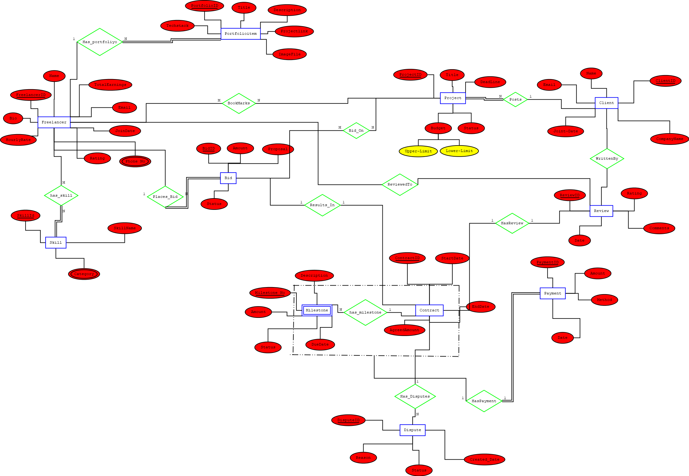

# Freelancer Marketplace Database System

A comprehensive **PostgreSQL-based database management system** designed for a modern freelancer marketplace platform. The project models the complete workflow between freelancers, clients, contracts, payments, reviews, and project management while following industry-standard database design principles.

---

## Project Overview

The Freelancer Marketplace Database enables:

* Freelancers to create profiles and showcase skills
* Clients to post projects and receive bids
* Bid management and freelancer selection
* Contract and milestone tracking
* Payment processing and earnings analysis
* Reviews and rating systems
* Administrative analytics and reporting

The database is designed using **ER Modeling**, **Functional Dependencies**, **BCNF Normalization**, and **Advanced SQL Queries** to ensure data integrity, scalability, and efficient querying.

---

## Key Features

### Database Design

* 16 fully normalized relations
* BCNF-compliant schema
* Well-defined primary and foreign key constraints
* Functional dependency analysis
* Candidate key identification

### Marketplace Functionality

* Freelancer profile management
* Skill categorization system
* Project posting and bidding
* Contract creation and management
* Milestone tracking
* Payment processing
* Review and rating system
* Bookmarking functionality

### Analytics & Reporting

* Freelancer analytics dashboard
* Client analytics dashboard
* Administrative platform insights
* Revenue tracking and trend analysis
* Skill demand vs supply analysis
* Freelancer performance evaluation

---

## Entity Relationship Diagram

> Add ER diagram image here

```markdown

```

---

## Database Schema

### Core Entities

| Entity         | Description                              |
| -------------- | ---------------------------------------- |
| Freelancer     | Stores freelancer information            |
| Client         | Stores client information                |
| Project        | Project details posted by clients        |
| Bid            | Bid information submitted by freelancers |
| Contract       | Accepted bid agreements                  |
| Milestone      | Project progress tracking                |
| Payment        | Payment transaction records              |
| Review         | Ratings and feedback system              |
| Skill          | Freelancer skill repository              |
| Skill Category | Skill classification system              |

---

## Normalization

This project follows a systematic database design process:

* Functional Dependency Analysis
* Candidate Key Identification
* BCNF Verification
* Redundancy Elimination
* Data Integrity Preservation

Documentation available in:

```text
normalization/
├── functional_dependencies.md
└── bcnf_proofs.pdf
```

---

## Dataset

The project contains a realistic dataset covering:

* Freelancers
* Clients
* Skills
* Skill Categories
* Projects
* Bids
* Contracts
* Milestones
* Payments
* Reviews
* Bookmarks
* Disputes

---

## SQL Query Collection

### Freelancer Queries

* Compare ratings with freelancers sharing similar skills
* Find projects matching personal skills
* Track bookmarked projects
* Analyze monthly earnings

### Client Queries

* Analyze bidding activity
* Compare freelancer profiles
* Monitor milestone progress
* Track project payment history
* Discover top-rated freelancers

### Admin Queries

* Platform revenue trends
* Skill demand vs supply gap
* Client-freelancer interaction analysis
* Platform activity reporting
* Top earners and spenders analysis

---

## Project Structure

```text
freelancer-marketplace-dbms/

├── README.md
│
├── schema/
│   ├── schema.sql
│   ├── relational_schema.pdf
│   └── ER_Diagram.png
│
├── normalization/
│   ├── functional_dependencies.md
│   └── bcnf_proofs.pdf
│
├── data/
│   ├── dummy_data.sql
│   └── sample_output/
│
├── queries/
│   ├── freelancer_queries.sql
│   ├── client_queries.sql
│   └── admin_queries.sql
│
├── docs/
│   ├── project_report.pdf
│   └── assumptions.md
│
└── screenshots/
```

---

## Technologies Used

* PostgreSQL
* SQL
* Database Normalization
* ER Modeling
* Relational Database Design

---

## Team Members

| Name           |
| -------------- |
| Praneel Sharma |
| Nihar Patel    |
| Ved Patel      |
| Shlok Thakkar  |
| Shlok Ukani    |

---

## Academic Information

**Course:** Database Management Systems (DBMS)

**Project Title:** Freelancer Marketplace Database System

---

## License

This project is developed for educational and academic purposes.
